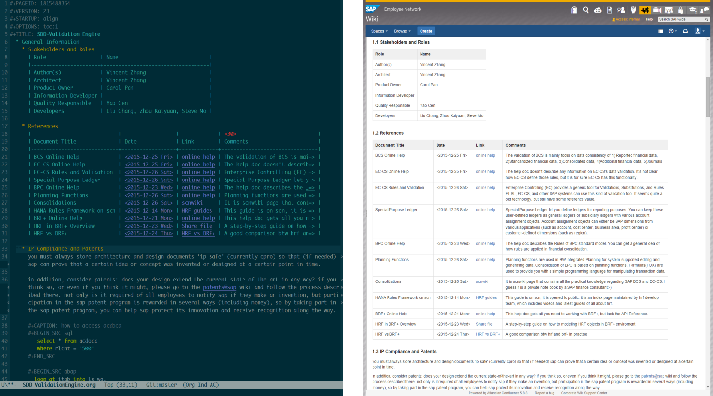
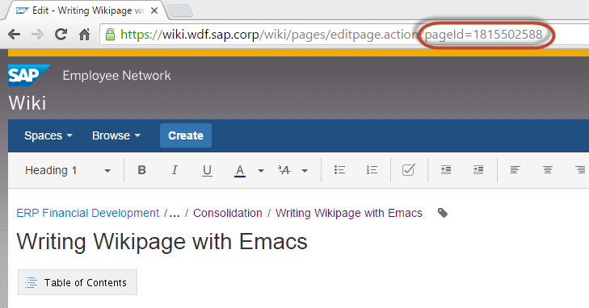
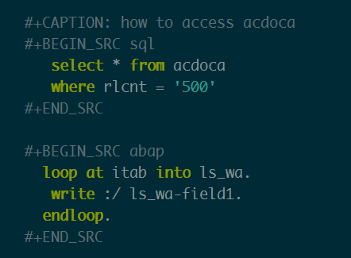
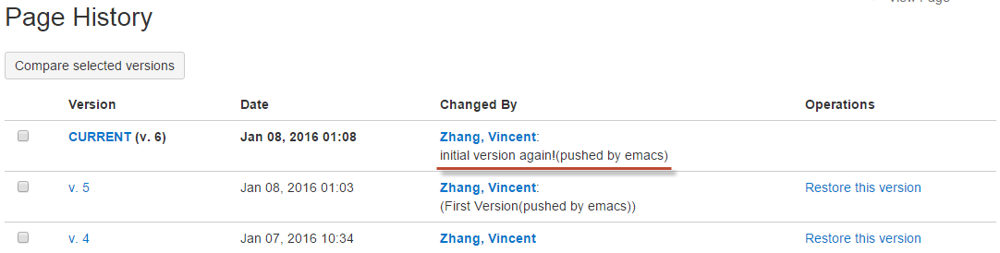

# Writing Wiki with Emacs Org-mode

Many software companies use Atlassian's wiki to write software documents. 
The clear view and simple sharing make everyone like it. However, writing
long articles on websites is not always the favor of many 
experienced writers. 

For those who write wiki without the bothering of using mouse, 
anywhere and anytime without the Internet, and 
most importantly, who dislike MS Word or other sophistic editor tools, 
**this one is for you!**

## Introduction
SAPWIKI is widely used among development teams inside SAP. 
A lot of Software Design Documents, Architecture Concept Documents, 
and Development Guidelines are written and published on SAPWIKI. 
Many teams have already composed very cool wiki pages and sites, 
but writing wiki with Emacs is even cool...



## Get and Install Emacs
You must run Windows, right? If you are a MAC user, then I believe you can dig it by yourself.

### Download Emacs binary

You can download from [Vincent's Baidu Pan](http://pan.baidu.com/s/1bXks0I), 
extract to your C:\ . Purely green install, and all configuration is done! This is the easiest way to get all stuff ready.

### Add following environment variables
HOME = c:\emacs

PATH = %HOME%\bin

### Run c:\emacs\bin\addpm.exe
This will create a shortcut in your startup menu

### Move folder c:\emacs\sapwiki to c:\SAP\sapwiki
Why do this? Because this is my folder structure, and you follow this to avoid re-configurations on file paths.

### You can now run Emacs by clicking the shortcut in your startup menu, or click runemacs.exe.
You can also create a shortcut on your desktop.

### Note:
#### In case you do not have font Monaco installed, you should install it.
Because Monaco is the best font for developers. 
1. Click "Monaco.ttf" in c:/emacs
2. Click the button "Install" in the up-left.

#### If you want spell check, you should install Aspell
1. Run Aspell-0-50-3-3-Setup.exe in c:/emacs
2. Run Aspell-0.50-2-3.exe to install English language dictionary
3. You can also download languages other than English through following URL: http://aspell.net/win32/

## What You Should Know before Writing
Emacs commands generally involve the CONTROL key (sometimes labeled
CTRL or CTL) or the META key (sometimes labeled EDIT or ALT).  Rather than
write that in full each time, we'll use the following abbreviations:

1. *C-<chr>*  means hold the CONTROL key while typing the character <chr>
   Thus, C-f would be: hold the CONTROL key and type f.

2. *M-<chr>*  means hold the META or EDIT or ALT key down while typing <chr>.
   If there is no META, EDIT or ALT key, instead press and release the
   ESC key and then type <chr>.  We write <ESC> for the ESC key.

3. *S-<chr>* means hold the SHIFT key down while typing <chr>.

## Writing Your First Emacs Wiki page
When you writing in Emacs, you are using the Org mode. 
Org is a mode for keeping notes, maintaining TODO lists, 
and project planning with a fast and effective plain-text system. 
It also is an authoring system with unique support for literate programming and reproducible research.

But don't worry, it is not necessary to go through Emacs and Org manuals to begin your writing. 
You just open Emacs and write down your thoughts only to follow some simple rules.

### Create A New Wiki Page 
You create a new blank wiki page under the right position in your company's Wiki site.
You can then get the page id from the URL parameter `pageid` when in editing mode. 
Write down the value of `pageid`.

  

### Create A New Org File
Open Emacs, type `C-x C-f`, and input the new file name in the bottom area.

  

You should create the new file in c:/SAP/sapwiki/work/. 
You can use <TAB> key to achieve auto-completion. 
The new file name should have the extension `.org`.

### Structure with Headlines
Headlines define the structure of an outline tree. 
The headlines in Org start with one or more stars, on the left margin

```
 * Top level headline
 ** Second level
 *** 3rd level
     some text
 *** 3rd level
     more text
     
 * Another top level headline
``` 

You can fold/unfold headlines. Place the cursor on the headlines, and then press <TAB> or S-<TAB>. 

### Ordered/Unordered List
Within an entry of the outline tree, hand-formatted lists can provide additional structure. 
#### Unordered list items start with "-" or  "+".

```
- book1
- book2
```

#### Ordered list items start with a numeral followed by either a period, such as "1. "

```
1. item1
2. item2
```

### Emphasis and monospace

```
You can make words *bold*, /italic/, _underlined_, =verbatim= and ~code~, and, if you must, +strike-through+.
```
 
### Insert a Table
Format table in Emacs is easy and fancy in plain ASCII. 
Any line with "|" as the first non-whitespace character is considered part of a table. 
"|" is also the column separator.

```
| Name  | Phone | Age |
|-------+-------+-----|
| Peter |  1234 |  17 |
| Anna  |  4321 |  25 |
```

A table is re-aligned automatically each time you press <TAB> or <RET> or C-c C-c inside the table. 
<TAB> also moves to the next field (<RET> to the next row) 
and creates new table rows at the end of the table or before horizontal lines. 
The indentation of the table is set by the first line. 
Any line starting with "|-" is considered as a horizontal separator line 
and will be expanded on the next re-align to span the whole table width. 
So, to create the above table, you would only type:

```
|Name|Phone|Age|
|-
```

and then press <TAB> to align the table and start filling in fields. 
Even faster would be to type |Name|Phone|Age followed by C-c <RET>.

### Insert a Image or Hyperlink
The general link format looks like this:
```
 [[link][description]]
 or
 [[link]] 
```

Images can be treated as links, and Captions could be added like this:

```
 #+CAPTION: Image Caption
 [[../image/DecisionTable.png]] 
```

### Insert Date/Time
Type `C-c .` will prompt for a date and insert a corresponding timestamp.

```
<2016-01-01 Fri>
```

### Insert Code Blocks
You can insert code snippets and examples using code block like this:

  

We support languages: ABAP, SQL, HTML, JavaScripts, CSS, Java ...

### Wire Org and Wiki Together
Insert following lines in the head of your Org file:

```
  #+PAGEID: 1815488354
  #+VERSION: 1
  #+STARTUP: align
  #+OPTIONS: toc:1
  #+TITLE: SDD-XXXX
```

1. `PAGEID` is the ID of the wiki page you just created in the first step. The Org file is wired with the wiki page via `PAGEID`.
2. `VERSION` is current version of the wiki page.
3. `STARTUP` `align` means the file will be nested when opening. It is optional.
4. `OPTIONS` `toc:1` means generating table of contents when uploading to SAPWiki; Use `toc:nil` to suppress TOC.
5. `TITLE` is the title of your wiki page.

### Login and Push to SAPWiki
When finish writing or you just want to upload your article to SAPWiki. Save you work (C-s), and follow steps below:

#### Customize Your Company Account
This is one-time customization. Next time Emacs will remember your ID.
1. Go to menu: Options->Customize Emacs->Top-level Customization Group
2. Search `sapwiki` in the search bar on top area.
3. Click search button, in the result list, click the triangle bullet in the item "Dk Sapwiki User: ".
4. Change the value to your company account.
5. Click "Apply and Save" in the upper area.
#### Login SAPWiki
Switch back to your working buffer, and type:
`M-x sapwiki-login <RET>`Enter your wiki password (used to login your windows system), 
<RET> and Emacs will print message "Login Successfully" if you type the right credential.

The password is remembered by Emacs if you do not close it. 
#### Push to SAPWiki
Type: `M-x sapwiki-push <RET>`. Enter version comments if you want, and press `<RET>` again. 
All your content will be converted to SAPWiki HTML format and then uploaded to SAPWiki site. 

If you have image links in your article and the images are placed in folder c:/SAP/sapwiki/image/, these images will be uploaded together.
#### Go to SAPWiki Pages to Verify
You can open the wired wiki page to do some verification, check if format or content is OK. 
It should be always OK.
 


## Cheating Sheet & Tricks
You can still use C-c and C-v for copy and paste, 
C-s and C-f for save and search, C-z for undo, and so on. 
Besides you can use following key combination to speed-up your writing and organization. 

### General Emacs Shortcuts 
1. *C-h C-h*: Help.
2. *C-g*: Quit.
3. *C-b*: Switch buffers.
4. *C-x k*: Kill buffer.
5. *C-x 0*: Close the active window.
6. *C-x 1*: Close all windows except the active window.
7. *C-x 2*: Split the active window vertically into two horizontal windows.
8. *C-x 3*: Split the active window horizontally into two vertical windows.
9. *C-x o*: Change active window to next window.
10. *C-x C-f*: Open file.
11. *C-x C-s*: Save file.
12. *C-x C-w*: Save file as.
13. *C-`<SPC>`*: Set region mark.
14. *C-s*: Search forwards
15. *C-r*: Search backwards
16. *C-`<left>`*: Move one word left
17. *C-`<right>`*: Move one word right
18. *C-`<up>`*: Move one paragraph up
19. *C-`<down>`*: Move one paragraph down

### Headlines Operation 
1. *`<TAB>`*: Subtree cycling, rotate current subtree among the states.
2. *S-`<TAB>`*: Global cycling, rotate the entire document among the states.
3. *M-`<RET>`*: Insert a new headline with the same level.
4. *C-`<RET>`*: Insert a new headline below the current heading.
5. *M-`<left>`*: Promote current heading by one level.
6. *M-`<right>`*: Demote current heading by one level.
7. *M-S-`<left>`*: Promote the current subtree by one level.
8. *M-S-`<right>`*: Demote the current subtree by one level.
9. *M-S-`<up>`*: Move subtree up
10. *M-S-`<down>`*: Move subtree down

### Table
1. *C-c `<SPC>`*: Blank the field at point.
2. *`<TAB>`*: Re-align the table, move to the next field. Creates a new row if necessary.
3. *S-`<TAB>`*: Re-align, move to previous field.
4. *`<RET>`*: Re-align the table and move down to next row. Creates a new row if necessary. At the beginning or end of a line, <RET> still does NEWLINE, so it can be used to split a table.
5. *M-`<left>`/M-`<right>`*: Move the current column left/right.
6. *M-S-`<left>`*: Kill the current column.
7. *M-S-`<right>`*: Insert a new column to the left of the cursor position.
8. *M-`<up>`/M-`<down>`*: Move the current row up/down.
9. *M-S-`<up>`*: Kill the current row or horizontal line.
10. *M-S-`<down>`*: Insert a new row above the current row. With a prefix argument, the line is created below the current one.
11. *C-c -*: Insert a horizontal line below current row. With a prefix argument, the line is created above the current line.
12. *C-c `<RET>`*: Insert a horizontal line below current row, and move the cursor into the row below that line.

### Date/Time
1. *C-c .*: Prompt for a date and insert a corresponding timestamp. When the cursor is at an existing timestamp in the buffer, the command is used to modify this timestamp instead of inserting a new one. When this command is used twice in succession, a time range is inserted.
2. *C-c !*: Like C-c ., but insert an inactive timestamp that will not cause an agenda entry.
3. *C-u C-c .*: Like C-c . and C-c !, but use the alternative format which contains date and time. The default time can be rounded to multiples of 5 minutes.
4. *S-`<left>`/S-`<right>`*: Change date at cursor by one day. These key bindings conflict with shift-selection and related modes.
5. *S-`<up>`/S-`<down>`*: Change the item under the cursor in a timestamp. The cursor can be on a year, month, day, hour or minute. When the timestamp contains a time range like "15:30-16:30", modifying the first time will also shift the second, shifting the time block with constant length. To change the length, modify the second time. Note that if the cursor is in a headline and not at a timestamp, these same keys modify the priority of an item. 

### Link
1. *C-c C-o*: Open link at point.
2. *C-c C-l*: Insert a link.

### Column width and alignment
The width of columns is automatically determined by the table editor. And also the alignment of a column is determined automatically from the fraction of number-like versus non-number fields in the column.

Sometimes a single field or a few fields need to carry more text, leading to inconveniently wide columns. Or maybe you want to make a table with several columns having a fixed width, regardless of content. To set 25 the width of a column, one field anywhere in the column may contain just the string "<N>" where "N" is an integer specifying the width of the column in characters. The next re-align will then set the width of this column to this value.

```
|       | <6>    |
| head1 | head2  |
|-------+--------|
|     1 | one    |
|     2 | two    |
|     3 | This=> |
|     4 | four   | 
```

Fields that are wider become clipped and end in the string "=>". Note that the full text is still in the buffer but is hidden. To see the full text, hold the mouse over the field, a tool-tip window will show the full content. To edit such a field, use the command C-c ` (that is C-c followed by the grave accent). This will open a new window with the full field. Edit it and finish with C-c C-c.

### Tricks on Spell Checking
You need to install ASpell to achieve spell check. Emacs already gets integration with it. The only thing you need to do is to tell where ASpell.exe resides. You set the variable "ispell-program-name" to the path of ASpell.

My suggestion is you do spell check after you finish writing, do not let the error spelling break your thoughts. Type `M-x ispell-buffer` if you want a spell check over your entire article. Or type  `M-x ispell-region` if you only want to check over a region. 

ASpell prompts suggestions listed in the top area. You select words by typing the bullet number before it. If you do not want do the replacement, type `SPC` to skip it, or type `i` to insert it to your local dictionary. 

_When you do spell check, remember to fully unfold your articles._

If you want to achieve the effect like when you writing in MS WORD. Error spelling words will be underscored on the fly, then you add following lines in the ".emacs" file:

```
(dolist (hook '(org-mode-hook))
  (add-hook hook (lambda () (flyspell-mode 1))))
```

_I personally DO NOT like flyspell mode. Because the red wave lines are really disruptive._

### Tricks on Ediff Comparing and Merging
Ediff is a powerful difference comparing and merging tool in GNU. You may need some time to get familiar with it.But I already did some configuration and developments so that Ediff is tailored to SAPWiki usage.

Ediff will be called when run `sapwiki-pull` and `sapwiki-push`. The 2 commands will do version comparing, if the remote version number is larger then the local version number, then Ediff will be called. The window is vertically split with left contains the local content, and the right contains the remote content. There is also a float frame, which can be expanded when you type `?`.  

Differences are marked, you can do merging by typing `a` or `b`. `a` means you accept the local version snippet, while `b` means you accept the remote version one. 

After all the differences are compared and merged, you type <q> followed by <y> to finish. The local version number is then set to the remote version number. You can then do push again.

My only suggestion is when you run Ediff, you should use a big desktop monitor, larger then 27". 

_When you do spell check, remember to fully unfold your articles._

## Sync with SAPWIKI
There are 4 commands used to sync with SAPWiki. They are login, push, pull, and fetch (prefixed with sapwiki-). The 4 commands can be called by typing like `M-x sapwiki-login`. If you are familiar with git, then these commands are quite similar. 

### sapwiki-login
You need first login SAPWiki site, then get permitted to do push, pull, and fetch. The login is based on you ID and password. ID can be saved permanently, while password is only recorded in emacs' transient memory. Password is not encrypted, so take care by yourself. 

You need to re-type your password if you restart your Emacs application. 

Once logged in, Emacs doesn't aware of when the session is timeout. Usually, the timeout length could be 15 minutes. But if you forget how long passed since your last login, you just run `sapwiki-login` again.

### sapwiki-push
Push command will upload your article content and images to a wired SAPWiki page. You can type a version comment or leave it empty. 

The push logic will first check the local version with the remote version. If the version is same, it will do the uploading and replace the remote content with the local content. Both the local version number and remote version number will be increased by 1. 

If the remote version number is larger than the local version number, for example, some one edit the wiki page using HTML editor and generates a new version. Then the uploading process will be terminated, and the fetching process will be initiated to fetch the content of the remote version. Then a comparison window frame will be showed to let your compare the 2 versions and do merging.

After merging, the local version number will be set to the remote version number. Then you can do push again.  
 
### sapwiki-pull
Pull command will fetch the remote content and convert it to org format. If version number is not same, then merging task should be done.

If the remote version is same with local version. Then the fetching process will be stopped, nothing will change. 

Otherwise, it will fetch the the remote content and convert it to Org format. Then initiate the comparison and merging process. After merging, the local version number will be set to the remote version number. 

### sapwiki-fetch
Fetch command only fetch the remote content and convert it to org format in a separate buffer named "result-org-buffer". Unlike pull, there will be no comparison and merging process initiated. 

## Limitations
The general limitation comes from the fact:
**Org format cannot be fully mapped to HTML**

You can use HTML to represent any format or layout you want. The limitation is only your imagination. But regarding with Org-mode, it is designed to focus on writing your thoughts down. It doesn't have such various layout representation. 

Following specific limitations should be aware of during your writing.

### Table cell can only contain one paragraph
The ASCII table has limitation on table layout. For example, you can use HTML to format a complex table with one cell contains a list or hierarchy, or even contains another table. 

ASCII table doesn't have such flexibility, you can only maintain one paragraph in one cell.
### List can not be nested (Resolved Already)
An item of a plain list cannot again have children lists. This limitation comes from my code. It is just a little difficult to convert the nested list into SAPWiki HTML format. I hope this can be resolved in near future. 
### Only 4 headline levels supported
You can only have 4 level headlines. `*` is corresponding to `<h1>`, `**` is corresponding to `<h2>`, and so on. The reason why only 4 levels supported is because I think it is enough. Two many levels only increase complexity and confusion. 
### SAPWiki session time-out cannot be noticed
After successful login, you may still need to run `sapwiki-login` again to refresh the login session. This will not be got automatically renewed. You need always keep in mind to run `sapwiki-login`, or strange error message will be pop up when you do push, pull, or fetch. 

 
## License
[The MIT License](http://opensource.org/licenses/MIT)
